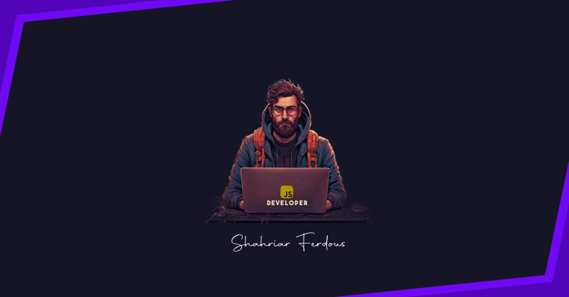

## Hi there 

<h3 align="center">A Passionate UX/UI Designer and MERN Developer.</h3>

 

:hearts: &emsp;I enjoy programming and sharing knowledge  
:computer: &emsp;Most used line of code `console.log("---")`  

#### Things I code with

         
